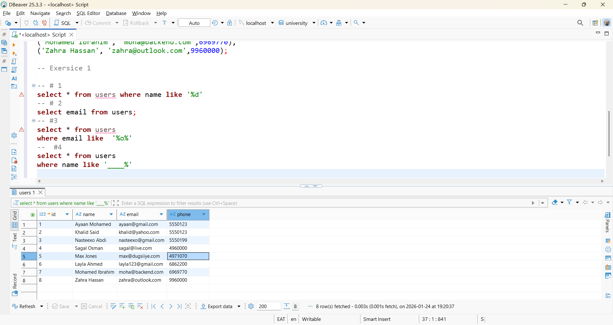
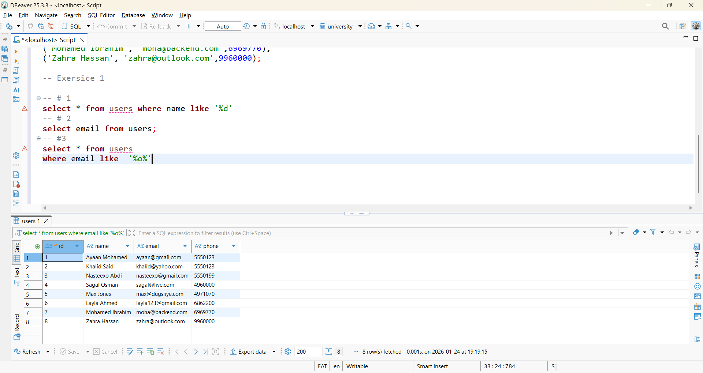

## Student Task Sheet

> Write the SQL queries to do the following:
> 
1. Find all students whose name ends with “d”.
2. Find all students with Gmail addresses.
3. Find all students whose email contains the letter “o”.
4. Find all students whose names are exactly 4 letters long (hint: use `_ _ _ _`).
5. Create your own search: maybe by domain, or name pattern.

