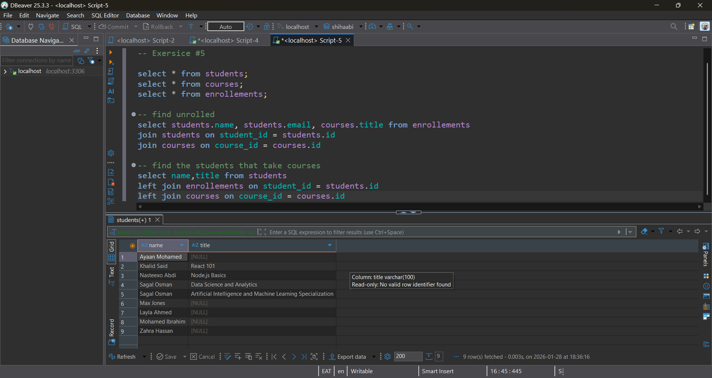

## 📝 Student Task Sheet

1. Create a relational schema (students, courses, enrollments)
2. Insert students, courses, and enrollments
3. Use INNER JOIN to find who is enrolled
4. Use LEFT JOIN to list all students + their courses (NULL if none)
5. BONUS: Count how many students per course using `GROUP BY`

