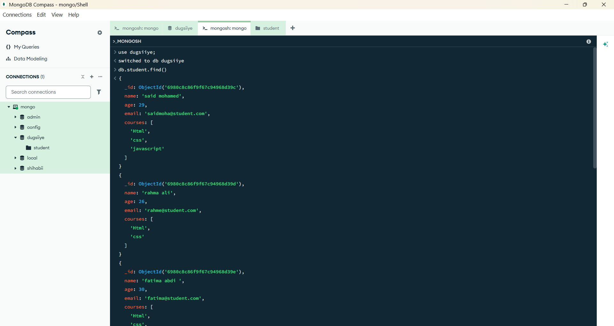
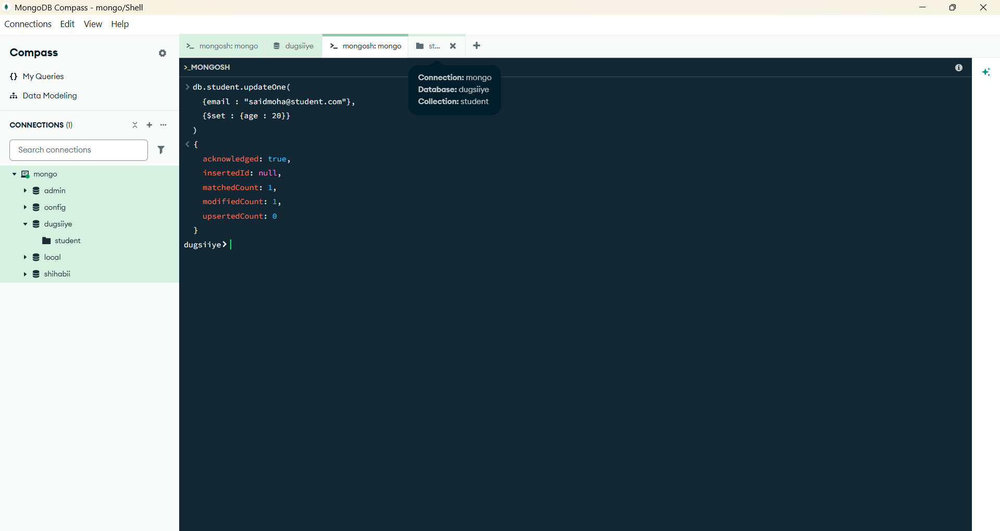
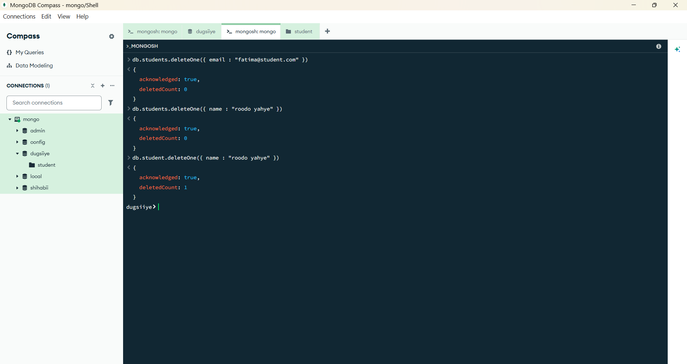
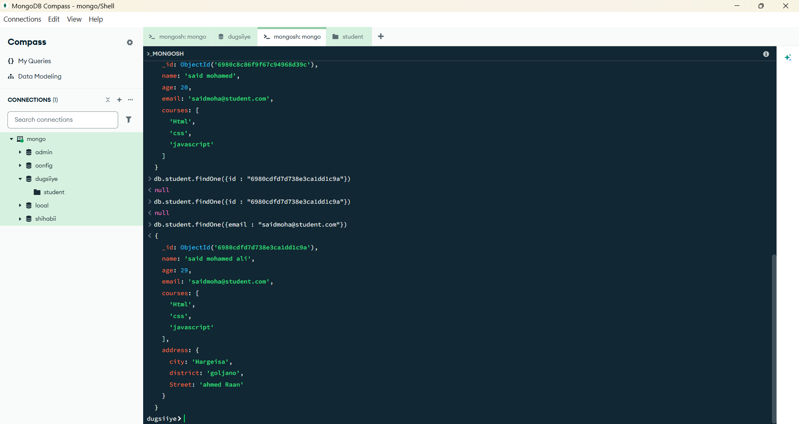

## 📝 Student Task Sheet

> In the shell or Compass:
> 
1. Create a `students` collection in a `dugsiiye` DB
2. Insert at least 3 students with fields:
    - `name`, `age`, `email`, `courses` (array)
3. Use `find()` to view the data
4. Update a student’s email
5. Delete one student
6. Optional: Insert a student with a nested `address` object

## **Find Students**

## **Update students**

## **Delete one student**

## **Optional: Insert a student with a nested `address` object**
