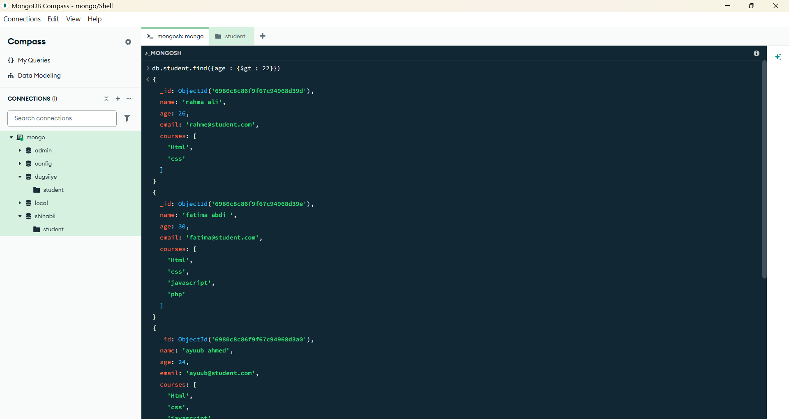
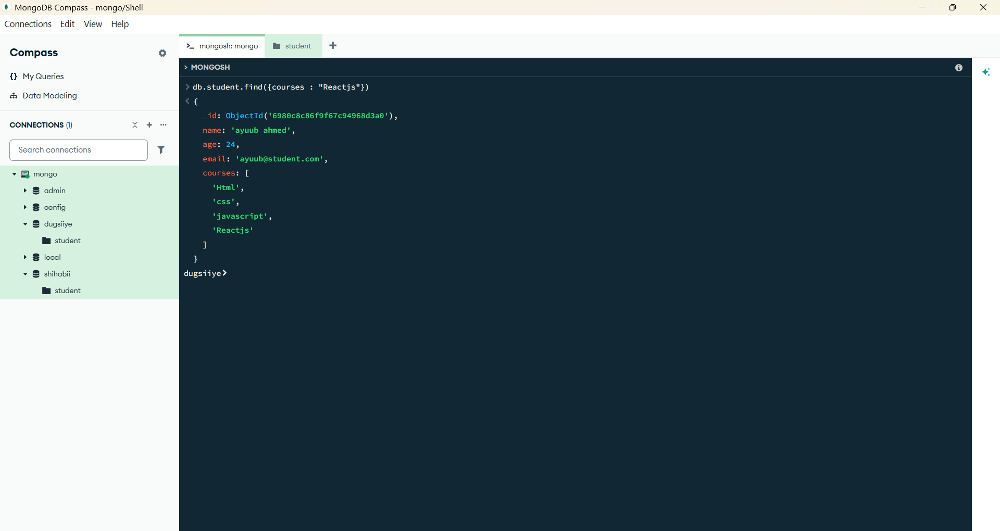
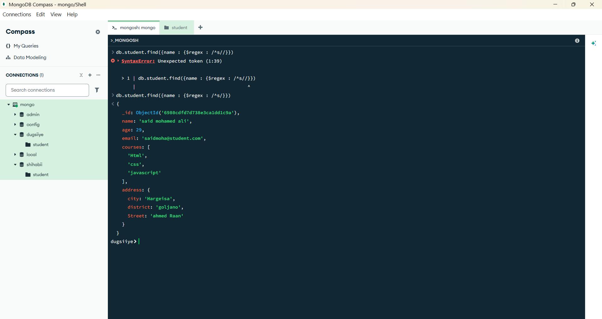
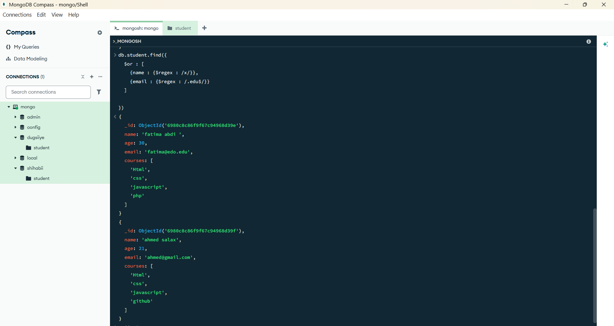

## 🧪 5. Practice Task List

> In Compass or the Mongo shell, write queries to:
> 
1. Find students older than 22
2. Find students enrolled in React
3. Find students whose name starts with 'S'
4. Find students whose age is either 18 or 21
5. Find students who are NOT using Gmail
6. Find students enrolled in React **and** older than 20
7. Find students enrolled in React **or** Node.js
8. BONUS: Use `$regex` to match names containing "x" or emails ending in `.edu`

## Find students older than 22

## Find students enrolled in React

## Find students whose name starts with 'S'

## Find students whose age is either 18 or 21

## Find students who are NOT using Gmail

## Find students enrolled in React **and** older than 20

## Find students enrolled in React **or** Node.js

## BONUS: Use `$regex` to match names containing "x" or emails ending in `.edu`

