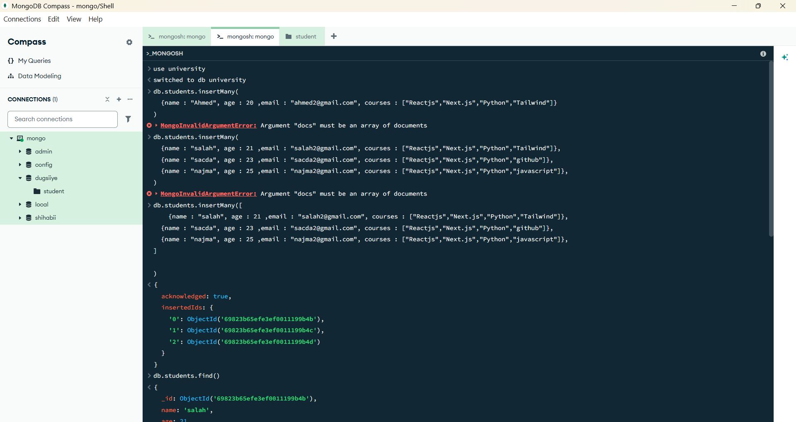
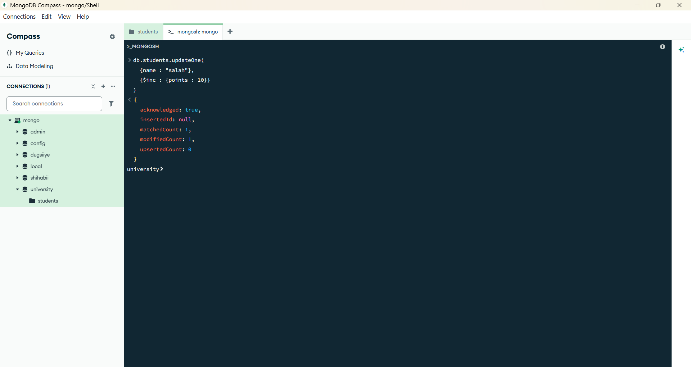
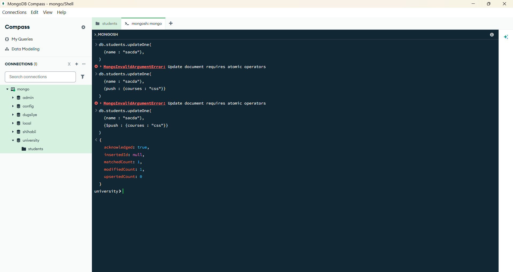
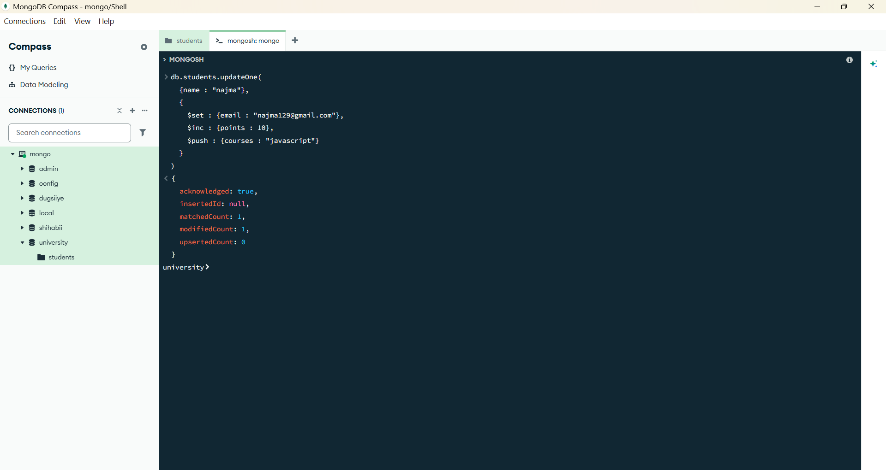
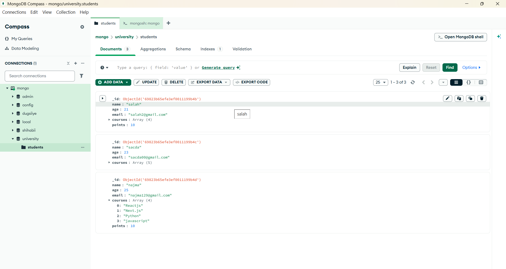

## 📝 Student Task Sheet

> In your local MongoDB shell or Compass:
> 
1. Insert 3 students with fields:
    - `name`, `email`, `points`, `courses` (array)
2. Use `$set` to update one email
3. Use `$inc` to increase points
4. Use `$push` to add a new course
5. Use `$pull` to remove a course
6. BONUS: Update one student with `$set`, `$inc`, and `$push` together

##  Insert 3 students with fields:
    - `name`, `email`, `points`, `courses` (array)

## Use `$set` to update one email

## Use `$inc` to increase points

## Use `$push` to add a new course

## Use `$pull` to remove a course

## Update one student with `$set`, `$inc`, and `$push` together

## After update
