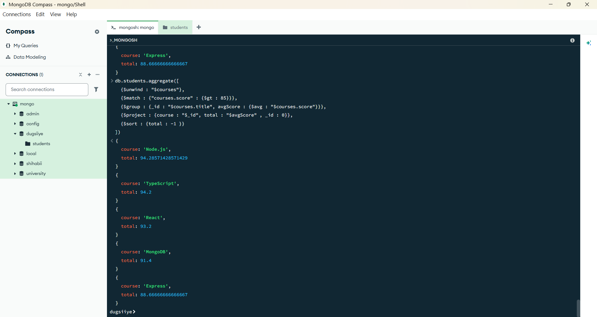
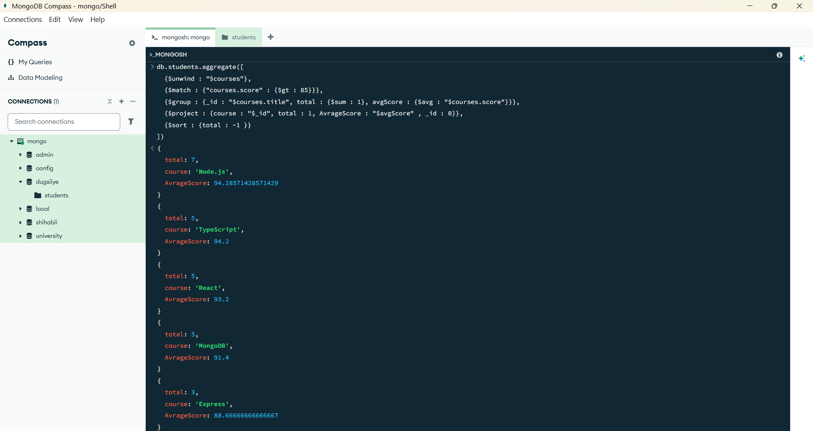

## 🔥 **Challenge: Find Top Scoring Courses (with Threshold)**

---

### 📘 Scenario:

You’re building an analytics tool for Dugsiiye’s admin dashboard.

Your manager wants to know:

> 🧠 “Which courses consistently attract high-performing students?”
> 

You decide to calculate:

- The number of students **who scored above 85** in each course
- Then sort the courses by how many **top performers** they have

### ✅ Requirements:

1. Use `$unwind` to flatten the `courses` array
2. Use `$match` to **filter only scores above 85**
3. Use `$group` to count how many top performers per course
4. Use `$project` to rename `_id` to `course`, and show `total`
5. Use `$sort` to order by most high scorers

### 💡 Bonus Challenge:

- Also calculate the **average score** of all students for each course
- Show both `total` and `avgScore`

