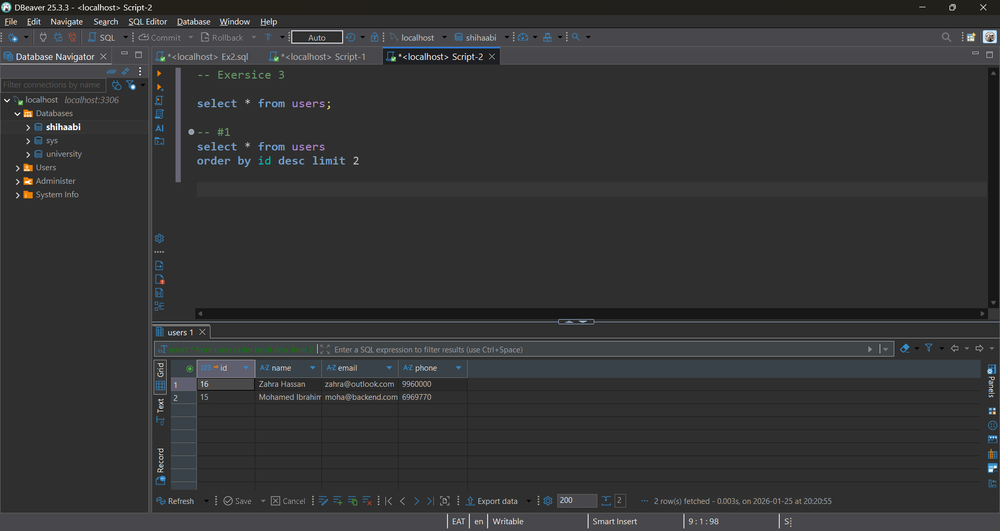
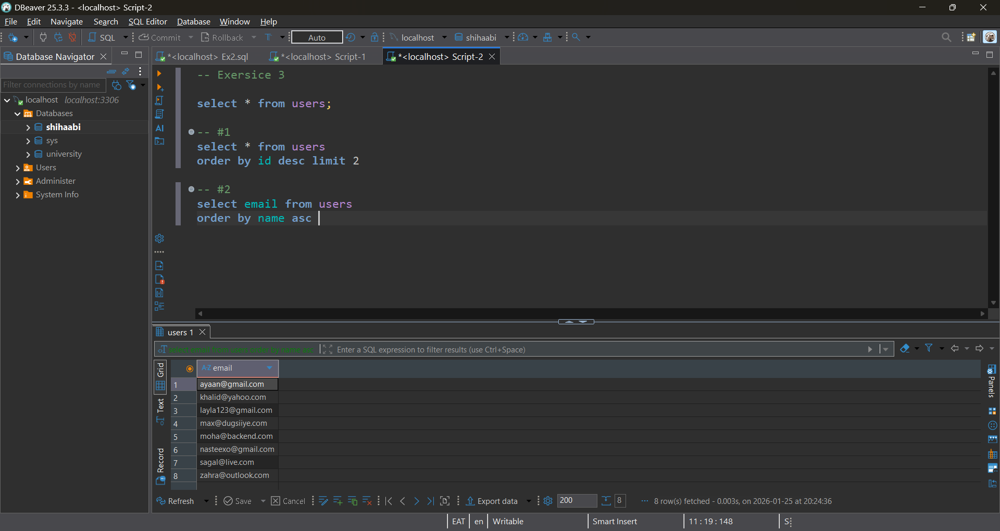
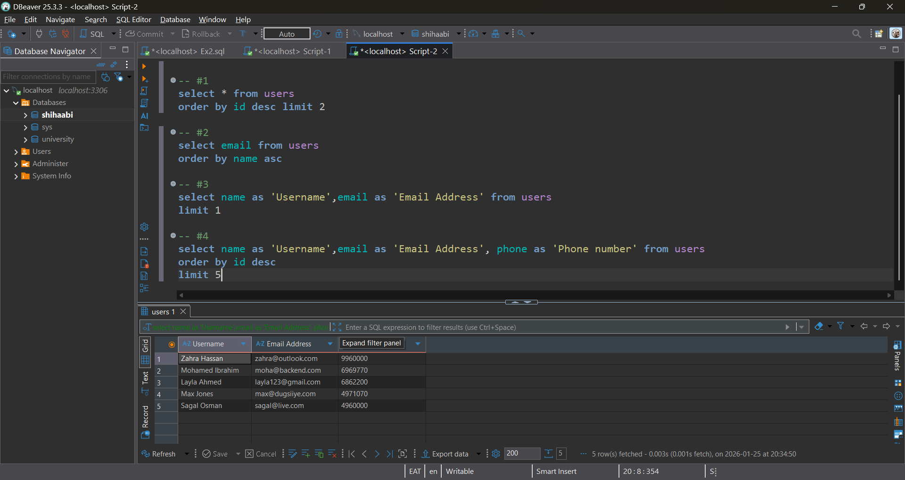

## ✅ Student Task Sheet

> Try writing queries for these:
> 
1. Show the last 2 students who registered.
2. Show only students with Gmail, sorted by name.
3. Limit results to 1 row and rename the columns to `Student` and `Email Address`.
4. Create your own variation that uses all 3: `ORDER BY`, `LIMIT`, and `AS`.

