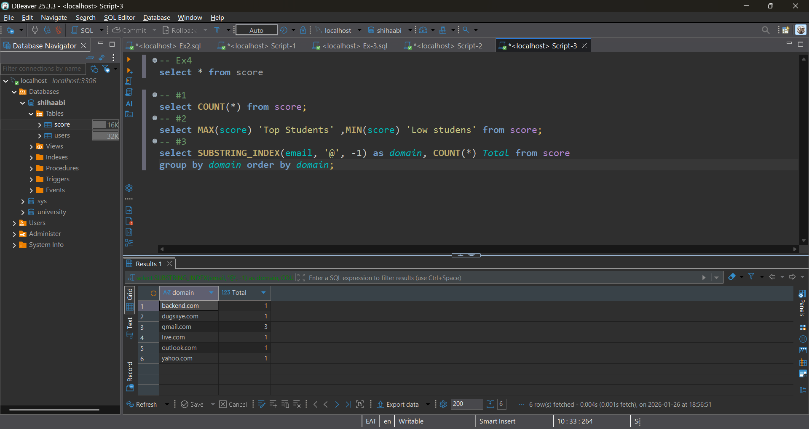

## 📝 Student Task Sheet

> Write the SQL to answer:
> 
1. How many students total?
2. What’s the highest and lowest score?
3. How many students per domain?
4. What is the average score of each domain group?

